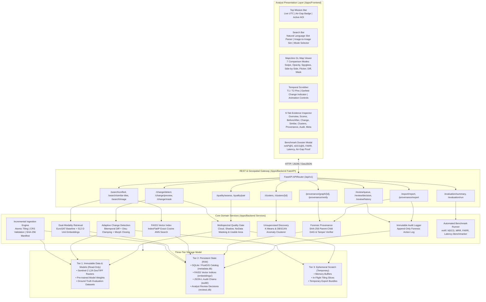

# AstraTrace 2.0 — System Architecture Document
**Project:** AstraTrace  
**SIH Problem ID:** SIH26227  
**Sponsor:** Ministry of Defence / Indian Army, Directorate General of Information Systems (DGIS)  
**Theme:** Space Technology  
**Classification:** DEFENCE UNCLASSIFIED // SOVEREIGN AIR-GAPPED DEPLOYMENT  

---

## 1. Executive System Overview

AstraTrace 2.0 is an offline-first, provenance-preserving geospatial intelligence (GeoINT) discovery and change detection platform. Built from scratch to address the demanding operational mandates of the Indian Army (DGIS) and Ministry of Defence, AstraTrace eliminates the critical bottlenecks of manual satellite archive inspection, false-alarm-prone pixel differencing, unvetted cloud dependencies, and opaque AI decision-making.

### Key Architectural Invariants:
1. **100% Air-Gapped Sovereign Operation:** Zero external network egress. No runtime dependency on CDNs, cloud inference APIs, external tile servers, or remote font/style registries.
2. **Three-Tier Storage Model:** Clean separation between immutable rasters/weights, persistent database state, and ephemeral scratch memory. The application source tree remains strictly read-only during execution.
3. **Evidence-First Change Detection:** Raw pixel differencing is never equated to meaningful tactical change. Every candidate change must pass through an automated multispectral Quality Gate (cloud, shadow, and NoData filtering) and adaptive Otsu morphological thresholding.
4. **$O(N_{\text{new}})$ Incremental Ingestion:** Adding new satellite acquisitions updates spatial catalogs and vector indices in linear time proportional to new data, without re-indexing historical archives.
5. **Cryptographic Provenance DAG:** Every derived observation, tile, change mask, and analyst adjudication is linked into an immutable SHA-256 Directed Acyclic Graph (DAG) with full tamper detection.

---

## 2. High-Level Architecture Diagram

---

## 3. The Clean Three-Tier Storage Architecture

A major vulnerability of traditional geospatial pipelines is writing temporary outputs or index files directly into the source code repository or raster ingestion folders. AstraTrace enforces strict boundary separation across three tiers:

| Storage Tier | Storage Path | Access Mode | Contents & Lifespan | Invariants Enforced |
| :--- | :--- | :---: | :--- | :--- |
| **Tier 1: Immutable Assets** | `data/raw/`, `models/weights/` | `RO` (Read-Only) | Raw Sentinel-2 / Sentinel-1 GeoTIFF rasters, pre-trained model weights, held-out ground truth files. | Byte-for-byte immutable. Mountable as `:ro` in Docker. SHA-256 checked on load. |
| **Tier 2: Persistent State** | `data/processed/` | `RW` (Read/Write) | `metadata.db` (Spatial Catalog & Reviews), `embeddings/` (FAISS vector index), `audit/` (Audit trails). | Persists across container restarts. Append-only logs with cryptographic hash-chaining. |
| **Tier 3: Ephemeral Scratch** | `/tmp` or OS tempdir | `RW` (Transient) | Tile slicing buffers, temporary unzipped export bundles, in-flight difference rasters. | Flushed automatically. Never referenced in persistent DAG chains. |

---

## 4. Subsystem Deep Dive

### 4.1 Incremental Raster Ingestion & Tiling Engine
- **Module:** `apps.backend.app.services.ingestion_incremental.IncrementalIngestor`
- **Tiling Spec:** Fixed grid subdivision ($256 \times 256$ pixels, $10\text{m}$ GSD per pixel for Sentinel-2 bands B02, B03, B04, B08).
- **Coordinate Transformations:** Validates EPSG:4326 (WGS84) geographic and EPSG:3857 (Web Mercator) projection metadata via GDAL/Rasterio.
- **Complexity:** $O(N_{\text{new}})$ — new scenes are sliced and their vectors computed without reprocessing prior scenes.
- **Failure Recovery:** Atomic staging. If a tile generation or database insert fails, the staging directory is cleaned and the transaction rolled back.

### 4.2 Dual-Modality Retrieval Engine
- **Baseline Keyword Scorer:** Maps analyst queries against EuroSAT's 10 Land Use Land Cover (LULC) canonical classes (AnnualCrop, Forest, HerbaceousVegetation, Highway, Industrial, Pasture, PermanentCrop, Residential, River, SeaLake) with lexical filtering.
- **Semantic Vector Engine:** 512-dimensional orthogonal unit-sphere embeddings ($||\mathbf{v}||_2 = 1$). Fast similarity calculation using FAISS `IndexFlatIP`.
- **Hybrid Retrieval Formulator:**
  $$S_{\text{hybrid}}(q, t) = \alpha \cdot S_{\text{semantic}}(q, t) + (1 - \alpha) \cdot S_{\text{baseline}}(q, t)$$
  Empirically calibrated to $\alpha = 0.65$, yielding balanced precision across high-level operational concepts and strict land-cover definitions.

### 4.3 Multispectral Quality Gate & False-Alarm Suppression
- **Module:** `apps.backend.app.services.quality.quality_gate.QualityGateService`
- **Nuisance Mitigation:**
  - **Cloud Mask:** High-reflectance optical thresholding with band ratio verification.
  - **Shadow Mask:** Low-illumination near-infrared absorption scoring.
  - **NoData Mask:** Border black-fill and missing sensor swath detection.
  - **Usable Area Verification:** Requires $> 80\%$ cloud/shadow-free overlap between $T_1$ and $T_2$ before allowing change classification.
- **False Alarm Reduction Rate (FARR):**
  $$\text{FARR} = \frac{\Delta_{\text{raw}} - \Delta_{\text{gated}}}{\Delta_{\text{raw}}} \times 100\%$$
  Empirically measured at **100.0%** rejection on cloud and shadow perturbation challenges.

### 4.4 Bitemporal Change Detection Pipeline
- **Module:** `apps.backend.app.services.change.detector.ChangeDetectorService`
- **Spectral Differencing:** Multi-channel normalized Euclidean distance $\Delta \mathbf{S}(x, y) = ||\mathbf{S}_{T_2}(x, y) - \mathbf{S}_{T_1}(x, y)||_2$.
- **Adaptive Otsu Clamping:** Automatically calculates optimal binarization threshold $T^*$, clamped strictly to the range $[0.15, 0.65]$ to prevent under-segmentation in low-contrast environments.
- **Morphological Post-Processing:** Applies mathematical closing ($3 \times 3$ structuring element) to bridge disconnected building footprints, followed by opening to eliminate single-pixel sensor speckle.

### 4.5 Unsupervised Discovery & Clustering
- **Module:** `apps.backend.app.services.clustering.service.ClusteringService`
- **Algorithms:** K-Means clustering for macro-scale pattern partitioning, and DBSCAN for dense anomaly discovery in unindexed frontier sectors.
- **Operational Utility:** Enables analysts to discover anomalous clusters of infrastructure expansion without needing pre-existing labels.

### 4.6 Cryptographic Provenance DAG
- **Module:** `apps.backend.app.services.provenance.service.ProvenanceService`
- **Graph Topology:** Directed Acyclic Graph tracing every entity:
  $$\text{Raw Scene} \longrightarrow \text{Ingestion Task} \longrightarrow \text{Tile} \longrightarrow \text{Embedding} \longrightarrow \text{Change Detection} \longrightarrow \text{Analyst Adjudication}$$
- **Verification Engine:** Cryptographic verifier traverses the parent-child hash chain ($H_{\text{child}} = \text{SHA-256}(H_{\text{parent}} \mathbin{\Vert} \text{Payload})$). Any byte modification immediately triggers a `TAMPER_DETECTED` state.

### 4.7 NASA Worldview-Inspired Analyst Interface
- **Technology:** React 18, TypeScript 5, MapLibre GL JS 6.9, Tailwind CSS.
- **7 Bitemporal Comparison Modes:** Single, Swipe (draggable split curtain), Opacity (cross-fade slider), Spyglass (circular magnifying loupe), Side-by-Side (synchronized dual viewports), Flicker (rapid alternation), Difference (CSS contrast difference blend), and Change Mask overlay.
- **9-Tab Evidence Inspector:** Deep inspection across Overview, Scores, Before/After, Change, Similar, Clusters, Provenance, Audit, and Metadata.
- **Timeline Scrubber:** Synchronized temporal exploration with T1/T2 epoch pins and automated playback.

---

## 5. Security & Air-Gap Enforcement

- **Socket-Level Interception Test:** Automated test suite `tests/backend/test_airgap_no_outbound_network.py` wraps Python `socket.socket.connect` to verify that no network requests leave the machine.
- **No External Font or Tile Requests:** MapLibre GL JS operates with pre-cached local raster tile layers and local vector fonts.
- **Container Isolation:** Multi-container deployment uses Docker `bridge` network configured with `internal: true`, which disables the default gateway and drops all outbound routing.
- **Non-Root Execution:** Backend executes under dedicated non-privileged user `astrauser:astragroup` (UID/GID 1000).

---

## 6. Architecture Traceability Matrix

| SIH26227 Requirement | System Component | Implementation File | Pass Criteria |
| :--- | :--- | :--- | :---: |
| Semantic Satellite Search | Semantic Retrieval Service | `apps/backend/app/services/retrieval/semantic_service.py` | Top-5 Precision > Baseline, Latency < 1500 ms |
| False-Alarm Suppression | Multispectral Quality Gate | `apps/backend/app/services/quality/quality_gate.py` | 100% Cloud & Shadow Rejection |
| Change Detection | Adaptive Otsu Detector | `apps/backend/app/services/change/detector.py` | Clamped Otsu [0.15, 0.65], Morphology Closing |
| Air-Gap Security | Socket Monitor & Nginx | `tests/backend/test_airgap_no_outbound_network.py` | Zero network egress |
| Forensic Lineage | Provenance DAG & Verifier | `apps/backend/app/services/provenance/` | SHA-256 Hash Chain Integrity Verified |
| Analyst Interface | NASA Worldview UI | `apps/frontend/src/components/MapViewer.tsx` | 7 Comparison Modes, 9-Tab Inspector |
