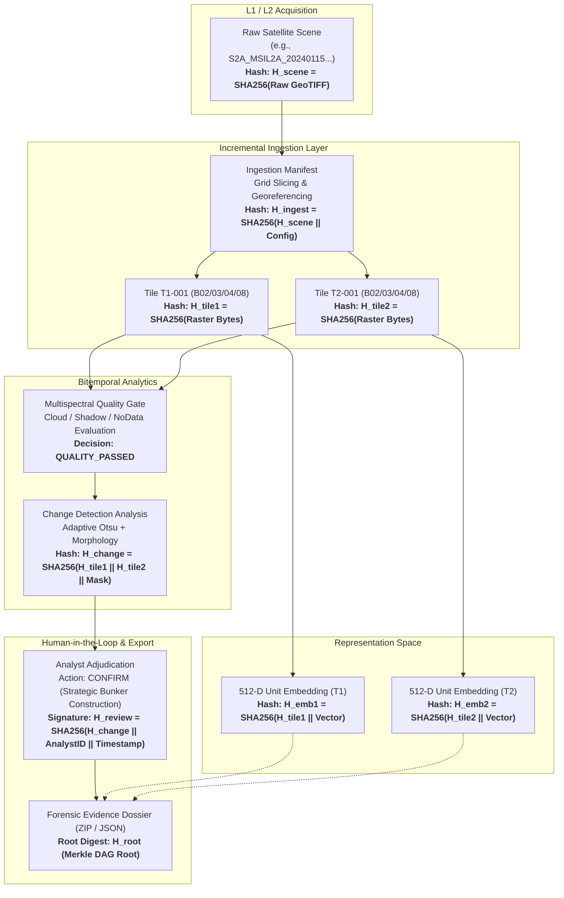

# AstraTrace 2.0 — Data Provenance & Cryptographic Integrity Architecture
**Project:** AstraTrace  
**SIH Problem ID:** SIH26227  
**Sponsor:** Ministry of Defence / Indian Army, Directorate General of Information Systems (DGIS)  
**Theme:** Space Technology  
**Classification:** DEFENCE UNCLASSIFIED // FORENSIC INTEGRITY SPECIFICATION  

---

## 1. Tactical Purpose & Forensic Chain-of-Custody

In military geospatial intelligence (GeoINT), intelligence evidence presented to operational commanders must withstand rigorous forensic scrutiny. A black-box system or untracked derivative image cannot be admitted as credible evidence for troop deployment or strategic decision-making.

AstraTrace enforces an **Immutable Cryptographic Provenance Directed Acyclic Graph (DAG)**. Every derived asset — whether a $256 \times 256$ orthorectified GeoTIFF tile, an extracted 512-dimensional vector embedding, an Otsu change mask, or an analyst's triage adjudication — is cryptographically linked back to the original raw satellite acquisition through a chain of SHA-256 digests.

---

## 2. Provenance DAG Topology & Entity Hierarchy



---

## 3. Cryptographic Hash Invariants

### 3.1 Raw Stream Hashing
Before any file is parsed by GDAL/Rasterio, its raw binary stream is evaluated:
$$H_{\text{raw}} = \text{SHA-256}(b_0, b_1, \dots, b_N)$$
This guarantees that no byte corruption or unauthorized header modification has occurred in the storage tier.

### 3.2 Parent-Child Digest Chaining
Every derivative node in the DAG computes its node hash $H_{\text{node}}$ by combining the SHA-256 digests of all parent nodes with its own canonical serialization payload $P$:
$$H_{\text{node}} = \text{SHA-256}\left(\left(\bigoplus_{i=1}^{k} H_{\text{parent}_i}\right) \;\Big\Vert\; \text{CanonicalJSON}(P)\right)$$

### 3.3 Zero-Drift Guarantee
Because parents are cryptographically bound to children:
- Altering a single pixel in an ingested tile alters $H_{\text{tile}}$.
- Altering $H_{\text{tile}}$ invalidates $H_{\text{emb}}$ and $H_{\text{change}}$.
- Invalidating $H_{\text{change}}$ breaks the analyst's signed review record $H_{\text{review}}$.
- The system immediately flags a **`TAMPER_DETECTED`** state upon verification.

---

## 4. Tamper Detection & Verification Engine

### 4.1 Verification Protocol (`apps.backend.app.services.provenance.verifier.ProvenanceVerifier`)
When an analyst or commanding officer inspects an observation, AstraTrace executes a deep graph audit:
1. **Fetch DAG:** Traverses upstream from the target observation to its root raw satellite scenes.
2. **Re-Hash Disk Artifacts:** Re-reads the physical GeoTIFF files, mask rasters, and database vector records from disk and recomputes their SHA-256 checksums.
3. **Graph Integrity Check:** Compares newly computed hashes against recorded DAG node hashes.
4. **Verification Status:**
   - `VERIFIED`: All hashes match; mathematical proof of custody is intact.
   - `TAMPER_DETECTED`: One or more node hashes mismatch. The corrupted node, expected hash, and actual hash are highlighted in red.
   - `ORPHANED`: Parent node references missing or deleted from catalog.

### 4.2 Verification REST Endpoint
```http
GET /api/v1/provenance/graph/{target_id}
```
**Sample Response:**
```json
{
  "target_id": "tile_s2a_20240115_x14_y08",
  "root_scene_id": "S2A_MSIL2A_20240115T052021_R019",
  "is_verified": true,
  "nodes": [
    {
      "id": "scene_root",
      "type": "RAW_SCENE",
      "sha256": "4b38d38e2d274534f36a83693e813f360f2257d0797176435a4d0f62b7245b08",
      "verified": true
    },
    {
      "id": "tile_t1_x14_y08",
      "type": "INGESTED_TILE",
      "sha256": "9a7522d46e27390efc3d7eb3d3284989182390aefd0637172fa82305a46c757c",
      "verified": true
    }
  ],
  "edges": [
    {"from": "scene_root", "to": "tile_t1_x14_y08", "relation": "EXTRACTED_FROM"}
  ]
}
```

---

## 5. Append-Only Forensic Audit Logging

All system operations — including queries executed, change runs, triage decisions, and exports — are committed to an append-only, tamper-evident log stored at `data/processed/audit/audit_log.jsonl`.

### 5.1 Audit Record Schema
```json
{
  "record_id": "aud_7f9c2d1b0a8e",
  "timestamp": "2026-09-19T10:45:22.104Z",
  "actor": "analyst_major_kumar",
  "action": "REVIEW_ADJUDICATION",
  "target_id": "change_pair_202401_202406_tile004",
  "decision": "CONFIRM",
  "notes": "Verified new graded road connecting to forward munitions dump.",
  "confidence_score": 0.942,
  "previous_record_hash": "e3b0c44298fc1c149afbf4c8996fb92427ae41e4649b934ca495991b7852b855",
  "record_hash": "7d5b91b6495b9c02d6b389f46b4028441113b2ab528f8702b37803e671d4316d"
}
```

### 5.2 Log Integrity Verification
Because each audit log entry embeds the `record_hash` of its predecessor, modifying or deleting an intermediate record breaks the hash chain for all subsequent entries.

---

## 6. Forensic Evidence Package Export

AstraTrace enables analysts to generate standardized, tamper-evident evidence packages for court-martial, tactical deconfliction, or command briefings.

### 6.1 Package Contents
- `evidence_manifest.json`: Cryptographic manifest containing SHA-256 hashes of all bundled assets and digital signature.
- `t1_optical.tif`: Cropped orthorectified GeoTIFF for acquisition epoch $T_1$.
- `t2_optical.tif`: Cropped orthorectified GeoTIFF for acquisition epoch $T_2$.
- `change_mask.tif`: Binary GeoTIFF mask highlighting verified structural changes.
- `provenance_graph.json`: Machine-readable DAG showing the complete lineage tree.
- `analyst_report.html`: Self-contained, offline-renderable HTML briefing dossier with dark-mode defense styling.
