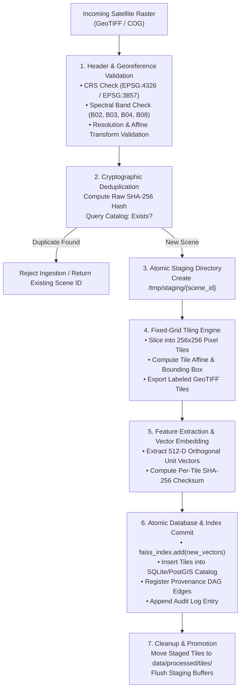

# AstraTrace 2.0 — Incremental Ingestion & Tiling Engine Specification
**Project:** AstraTrace  
**SIH Problem ID:** SIH26227  
**Sponsor:** Ministry of Defence / Indian Army, Directorate General of Information Systems (DGIS)  
**Theme:** Space Technology  
**Classification:** DEFENCE UNCLASSIFIED // INGESTION SPECIFICATION  

---

## 1. Architectural Problem & $O(N_{\text{new}})$ Invariant

Traditional satellite retrieval platforms frequently suffer from an exponential maintenance bottleneck: whenever a new satellite pass or scene is added to the system, the platform re-indexes the entire image archive, recomputes all feature vectors, or rebuilds spatial trees from scratch. For operational defense catalogs containing thousands of satellite scenes, this causes prohibitive downtime and computational waste.

AstraTrace enforces an **$O(N_{\text{new}})$ Incremental Ingestion Invariant**:
- **Linear Ingestion Time:** The time to ingest a new scene depends strictly on the dimensions of the incoming scene $N_{\text{new}}$, completely decoupled from the size of historical archives $N_{\text{total}}$.
- **Stable ID Mapping:** Existing vector IDs, tile identifiers, and provenance links are immutable.
- **Index Additive Update:** The vector index uses FAISS `index.add(new_vectors)`, appending new representations without altering historical index topology.

---

## 2. Ingestion Pipeline Workflow



---

## 3. Subsystem Implementation Details

### 3.1 Georeferencing & Spatial Verification
Implemented in `apps.backend.app.services.ingestion_incremental.IncrementalIngestor`:
- Uses GDAL/Rasterio to inspect input rasters.
- Ensures valid geographic coordinate reference system (CRS) definition. Reprojects to EPSG:4326 if necessary.
- Validates the affine transformation matrix $\begin{bmatrix} a & b & c \\ d & e & f \\ 0 & 0 & 1 \end{bmatrix}$ to ensure precise ground sample distance ($10\text{m/pixel}$ for Sentinel-2).

### 3.2 Fixed-Grid Tiling Spec
- **Tile Dimensions:** $256 \times 256$ pixels (approx. $2.56\text{ km} \times 2.56\text{ km}$ footprint on ground).
- **Format:** Cloud-Optimized GeoTIFF (COG) or uncompressed LZW GeoTIFF.
- **Bands:** 4-channel stack (B02 Blue, B03 Green, B04 Red, B08 Near-Infrared).
- **Tile Naming Convention:**
  ```
  tile_{scene_hash[:8]}_x{tile_x:03d}_y{tile_y:03d}.tif
  ```

### 3.3 Transactional Rollback & Staging Safety
To guarantee that a power outage, crash, or disk-full event never corrupts the persistent catalog:
1. All tile slices are initially written to an isolated staging directory (`data/processed/.staging/{ingest_id}`).
2. The SQLite / PostGIS catalog updates are held in an open database transaction.
3. If any step fails (e.g., corrupt tile, dimension mismatch), the database executes an automatic `ROLLBACK`, the staging directory is recursively deleted, and an error is logged.
4. Only upon successful completion of all tile writes and vector insertions is the database transaction committed.

---

## 4. CLI Execution & Operational Usage

### 4.1 Ingest a New Satellite Scene
```powershell
python scripts/ingest_scene.py \
  --input "data/raw/sentinel2/S2A_MSIL2A_20240115_T43RER.tif" \
  --aoi "Western_Command_Sector_A" \
  --timestamp "2024-01-15T05:30:00Z"
```

### 4.2 Batch Ingestion Run
```powershell
python scripts/ingest_scene.py \
  --batch-dir "data/raw/incoming_passes/" \
  --aoi "Northern_Border_Surveillance"
```

### 4.3 Programmatic API Ingestion
```http
POST /api/v1/ingestion/upload
Content-Type: multipart/form-data

file=@S2A_20240620.tif; aoi="Sector_Bravo"
```
